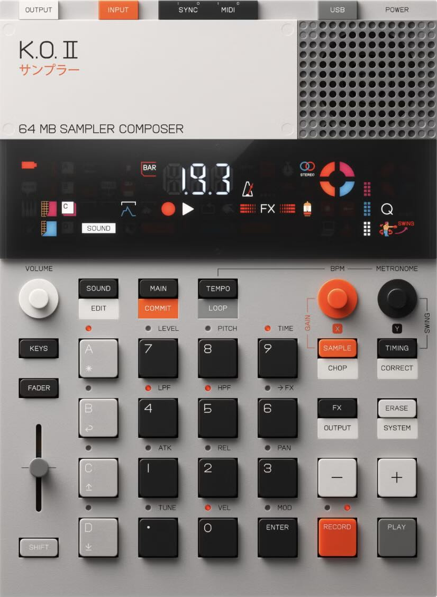

# MCP Interface for Teenage Engineering EP-133 K.O. II




This project is a Model Context Protocol (MCP) server that acts as a controller for the Teenage Engineering EP-133 K.O. II sampler via MIDI

## Features

- Connect to your EP-133 K.O. II device via MIDI
- Play notes and patterns through text commands
- View the default pad configuration to understand sound mapping
- Create and play drum patterns with a simple text-based syntax
- Support for multiple instrument reference methods (pad labels, MIDI notes, instrument names, sound names)
- Simultaneous playback of multiple instruments in drum patterns
- Integration with Claude through MCP

## Installation

### Prerequisites

- Python 3.8 or later
- `mido` (MIDI handling)
- `mcp` (Model Context Protocol SDK)

### Quick Install

```bash
# Install the required packages
pip install mido "mcp[cli]"

# Clone the repository
git clone https://github.com/benjaminr/mcp-koii.git
cd mcp-koii

# Install the MCP server
mcp install koii_server.py:server -e .
```

## Usage with Claude Desktop

1. Make sure your EP-133 K.O. II is connected to your computer via USB.

2. Launch Claude Desktop with MCP enabled.

3. Start controlling your EP-133 K.O. II by asking Claude natural language questions like:
   - "List available MIDI ports"
   - "Connect to the EP-133 device"
   - "Play a C major scale"
   - "Play a drum pattern with kick on beats 1 and 3, snare on 2 and 4, and hi-hat on every 8th note"

## Running in Development Mode

You can run the MCP server in development mode to test it without Claude Desktop:

```bash
# Run with the inspector UI
mcp dev koii_server.py:server -e .
```

## Features and Commands

### Basic Commands

- **List available MIDI ports**: Shows all available MIDI output ports on your system.
- **Connect to a MIDI device**: Connect to the EP-133 K.O. II by name or port number.
- **Disconnect**: Close the connection to the current MIDI device.

### Playing Notes and Patterns

- **Play a note**: Play a single note with specified velocity and duration.
- **Play a pattern**: Play a sequence of notes with timing information.
- **Play a drum pattern**: Play a text-based drum pattern.

### Sound Browser

- **List sound categories**: View available sound categories (Kicks, Snares, etc.).
- **List sounds in category**: Browse sounds within a specific category.
- **Get default pad configuration**: See which sounds are mapped to each pad by default.

## MIDI Implementation

The EP-133 K.O. II responds to the following MIDI messages:

- **Note On/Off**: Triggers sounds on pads (C2-B5, notes 36-83)

## Drum Pattern Syntax

The drum pattern system supports four different ways to reference sounds:

### 1. Using instrument names:
```
x...x...x...x...  # kick
....x.......x...  # snare
x.x.x.x.x.x.x.x.  # hi-hat
```

### 2. Using pad references:
```
x...x...x...x...  # A.
....x.......x...  # A2
x.x.x.x.x.x.x.x.  # A5
```

### 3. Using MIDI note numbers:
```
x...x...x...x...  # 36
....x.......x...  # 40
x.x.x.x.x.x.x.x.  # 43
```

### 4. Using sound names:
```
x...x...x...x...  # "MICRO KICK"
....x.......x...  # "NT SNARE"
x.x.x.x.x.x.x.x.  # "NT HH CLOSED"
```

### 5. Mixed references:
```
x...x...x...x...  # A.       (pad reference)
....x.......x...  # 40       (MIDI note)
x.x.x.x.x.x.x.x.  # hi-hat   (instrument name)
......x.........  # "NT RIDE" (sound name)
```

### Pattern Format

- Each line represents a different instrument/sound
- 'x' or 'X' indicates a hit (high velocity)
- 'o' or 'O' indicates a softer hit (lower velocity)
- '.' indicates no hit
- Each position represents a 16th note
- Comments after '#' specify what sound to trigger using any of the reference methods
- Multiple instruments can be triggered simultaneously with their hits overlapping

## Default Drum Mappings

| Instrument      | Pad | MIDI Note | Default Sound     |
|-----------------|-----|-----------|-------------------|
| kick            | A.  | 36 (C2)   | MICRO KICK        |
| snare           | A2  | 40 (E2)   | NT SNARE ALT      |
| clap            | A3  | 41 (F2)   | NT CLAP           |
| low tom         | A4  | 42 (F#2)  | NT TAMBO          |
| closed hi-hat   | A5  | 43 (G2)   | NT HH CLOSED      |
| mid tom         | A6  | 44 (G#2)  | NT RIDE           |
| high tom/perc   | A7  | 45 (A2)   | NT PERC           |
| open hi-hat/ride| A8  | 46 (A#2)  | NT HH OPEN        |
| crash/cymbal    | A9  | 47 (B2)   | NT RIDE C         |
| bass            | B.  | 48 (C3)   | NT BASS           |
| melodic         | C.  | 60 (C4)   | BLUE              |

## Troubleshooting

- **No MIDI ports found**: Make sure your EP-133 K.O. II is connected and powered on.
- **Connection issues**: Try reconnecting the USB cable or restarting your EP-133.
- **Notes not playing**: Verify that the device is in the correct MIDI mode.
- **Multiple instruments not playing simultaneously**: Use a higher BPM value to ensure the EP-133 K.O. II can process all notes during playback.
- **Unknown instruments**: Use exact instrument names, pad labels, MIDI notes or sound names in quotes.

## License

This project is licensed under the MIT License - see the LICENSE file for details.

## Acknowledgments

- [Teenage Engineering](https://teenage.engineering/) for the EP-133 K.O. II.
- [Anthropic](https://www.anthropic.com/) for Claude and the Model Context Protocol.
- [MIDO](https://mido.readthedocs.io/) for the MIDI handling library.
